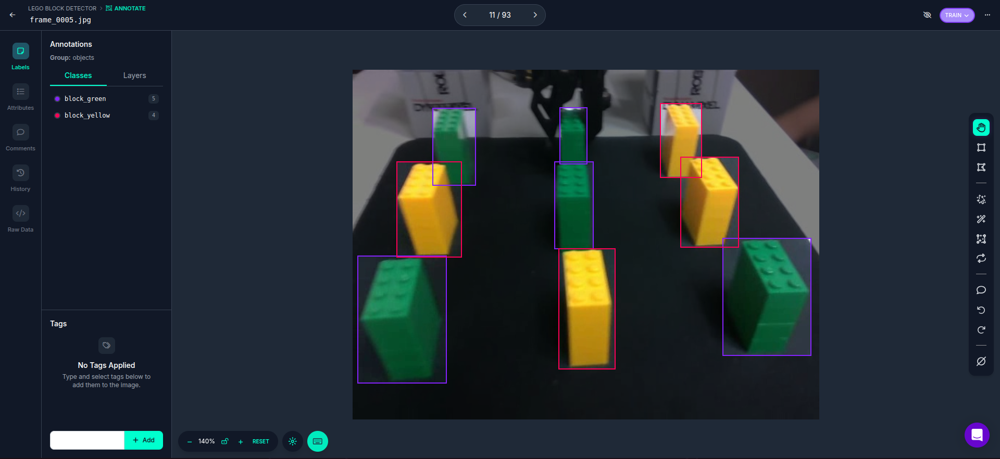

### 0. 주요 내용

- YOLOv8 기반 커스텀 데이터셋으로 학습 시키기

### 1. 환경 구성 및 도구 설치
아래 내용은 miniconda 환경에서 진행하였으며, python version은 3.10

#### Hailo DFC (Data Flow Compiler)
데스크톱/랩탑에 설치
https://hailo.ai/developer-zone/documentation/dataflow-compiler-v3-31-0/?sp_referrer=install/install.html

Dependencies
```
sudo apt install graphviz libgraphviz-dev python3-tk
```

```
pip install hailo_dataflow_compiler-3.31.0-py3-none-linux_x86_64.whl
```


#### hailo model zoo
데스크톱/랩탑에 설치
```
git clone https://github.com/hailo-ai/hailo_model_zoo.git
```

```
cd hailo_model_zoo; pip install  -e .
```


### 2. 커스텀 데이터셋 만들기
- 레고 블럭을 인식하는 모델을 만들기 위한 데이터셋 만들기
- Roboflow를 이용해 데이터셋 만들기 (라벨링)
- 데이터셋 업로드 후 모델 학습
- 학습된 모델 평가
- 모델 저장 후 사용

##### 영상 녹화하기
카메라 장치 (예:/dev/videoX)에 들어오는 영상을 OpenCV로 녹화하였음.

##### 10fps 마다 적절히 프레임을 쪼개기
30fps 영상에서 1fps마다 전부 가져오면 양도 많고 다양한 상황에 대한 데이터를 얻진 못함.
그래서 10fps정도로 적절히 쪼개서 저장.

##### roboflow에 이미지 올리고 라벨링 (대략 100장)


##### 라벨 타입 YOLOV8로 지정 후 다운로드
data.yaml에서 클래스명, 클래스 개수(nc) 수정

##### 모델 학습 (YOLOv8s)
```
sudo docker run --name yolov8_train   -it --gpus all --ipc=host   -v /home/jwj/oroca/dataset:/workspace/dataset   yolov8:v0
```
```
yolo detect train data=data.yaml model=yolov8s.pt name=block_detector epochs=100 batch=8
```

onnx로 변환
```
yolo export model=./best.pt imgsz=640 format=onnx opset=11
```

hef로 변환 
```
hailomz compile --ckpt best.onnx --calib-path ./calib/ --yaml /home/jwj/hailo/hailo_model_zoo/hailo_model_zoo/cfg/networks/yolov8s.yaml --classes 2
```

### 3. Inference
라즈베리파이 U22.04, python3.11
```
source setup_env.sh
```
```
python basic_pipelines/detection.py --input /dev/video4
```

라벨이 coco 데이터셋 기준으로 나오는 문제있음. 하지만 각각 디텍션은 잘됨

