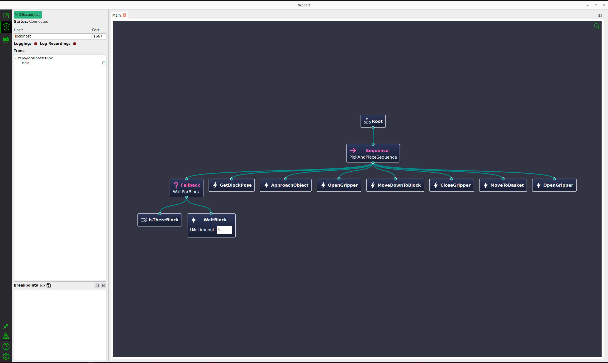

### 0. 주요 내용

- 블록 인식 후 어떻게 할건지 시퀀스를 쉽게 작성할 수 있도록 도와주는 Behavior Tree 도입

### 1. 설치 & 빌드
```
cd ~/ros2_ws/src
git clone https://github.com/BehaviorTree/BehaviorTree.CPP.git
colcon build --symlink-install --packages-select behaviortree_cpp
```

### 2. 트리 구성
```
<?xml version='1.0' encoding='UTF-8'?>
<root BTCPP_format="4">
  <BehaviorTree ID="Main">
    <Sequence name="PickAndPlaceSequence">
      
      <Fallback name="WaitForBlock">
        <IsThereBlock/>
        <WaitBlock timeout="5"/>
      </Fallback>

      <GetBlockPose/>
      <ApproachObject/>
      
      <OpenGripper/>
      <MoveDownToBlock/>
      <CloseGripper/>

      <MoveToBasket/>
      <OpenGripper/>

    </Sequence>
  </BehaviorTree>
</root>
```

behavior tree 시각화 도구인 groot2에서 본 트리 모습

### 3. 노드 기능 구현

