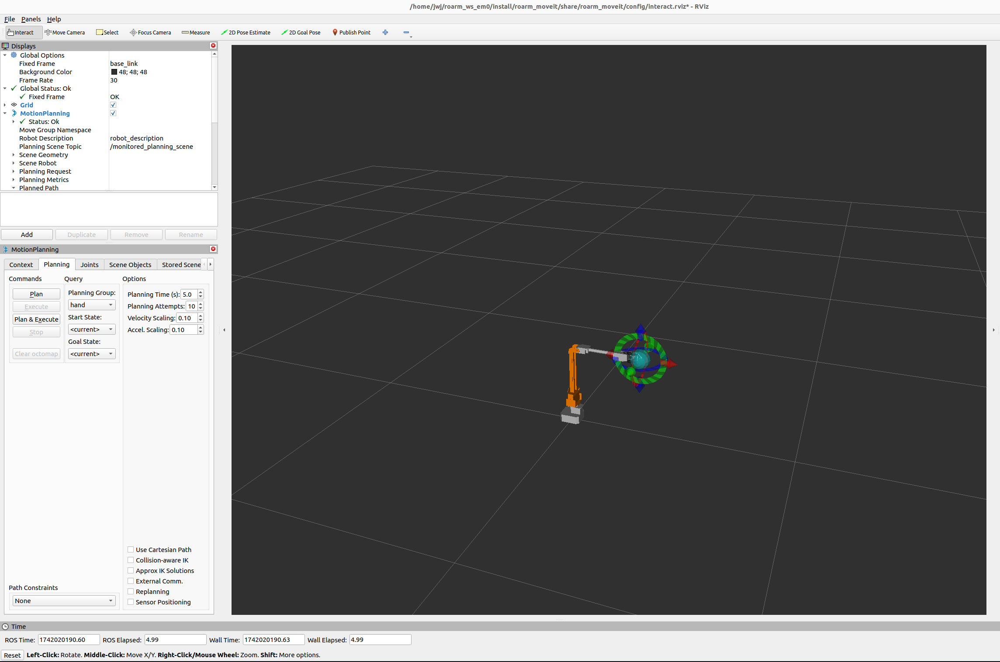
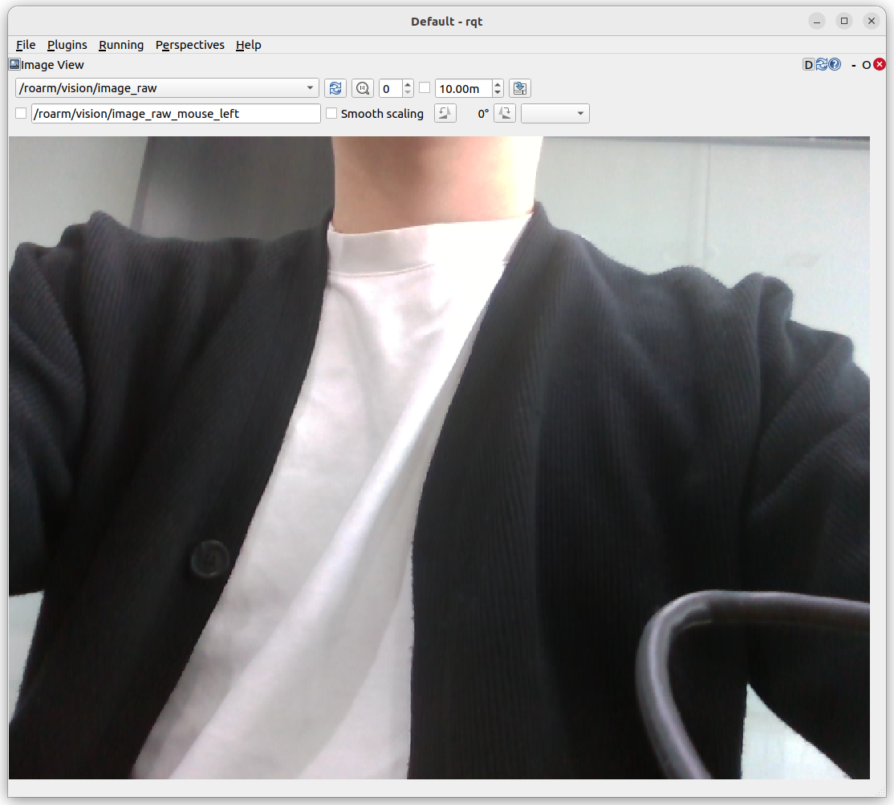

### 0. 주요 내용

- Web Interface로 로봇팔을 제어해보았음.
- 드라이버 노드를 실행 후 토픽으로 로봇팔을 제어해보았음.
- Moveit2을 이용해서 로봇팔을 제어해보았음.
- 카메라 노드를 만들어 frame과 camera info를 퍼블리시 해보았음.

### 1. 드라이버 노드만으로 로봇팔 제어
- 실제 로봇을 움직이려면 드라이버 노드를 실행해야한다.
- 드라이버 노드의 역할은 esp32와 ros2가 통신할 수 있도록 한다.

##### 드라이버 노드 실행
```
ros2 run roarm_driver roarm_driver
```

##### 토픽 확인
```
ros2 topic list
```

##### 퍼블리시 해보기
1. 조인트 제어
    ```
    ros2 topic pub -1 /joint_states
    ```

2. LED 온/오프
   ```
    ros2 topic pub -1 /led_ctrl std_msgs/msg/Float32 'data: 255.0'
    ```


### 2. Moveit2을 이용해서 로봇팔 제어
- Moveit2를 실행 후 rviz2에서 드래그 앤 드롭으로 움직일 수 있다.
- 노드를 실행 후 서비스로도 명령을 전달 할 수 있다.
- 앞의 드라이버만으로 로봇팔 제어하는것과 차이는 궤적을 생성해서 움직인다는 것이다.

##### 드라이버 노드 실행
```
ros2 run roarm_driver roarm_driver
```

##### Moveit2 실행
```
ros2 launch roarm_moveit interact.launch.py
```



##### 노드 실행
```
ros2 run roarm_moveit_cmd movepointcmd
```

##### 서비스로 명령 주기
```
ros2 service call /move_point_cmd roarm_moveit/srv/MovePointCmd 'x: 0.1 y: -0.2 z: 0.3'
```


### 3. 카메라 노드 실행과 토픽 퍼블리시
- 카메라 노드를 실행 후 토픽으로 프레임과 camera info를 퍼블리시 해보았다.

##### 카메라 노드 실행
```
ros2 run roarm_camera roarm_camera
```

##### 토픽 확인
```
ros2 topic list
```

##### rqt로 토픽 subscribe 후 확인
```
rqt
```

