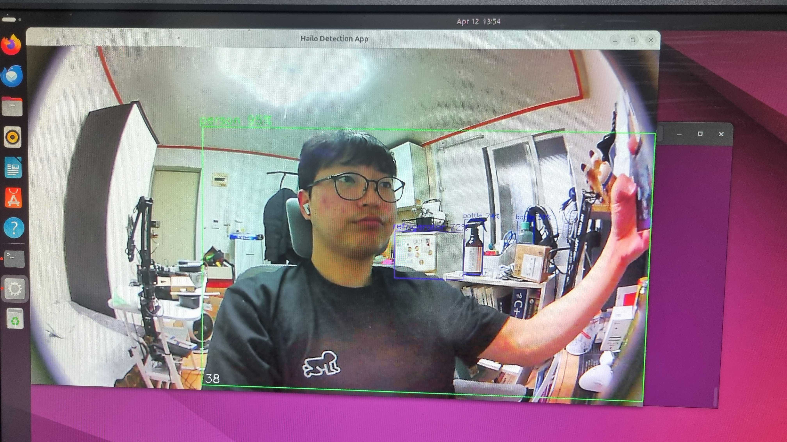

### 0. 주요 내용

- RoArm 시뮬레이션 만들기
- 라즈베리파이5 + AI HAT을 이용한 YOLOv8
- VNC 환경 구성하기

### 1. RoArm 시뮬레이션 만들기
- urdf은 있지만 RoArm에서 제공해주는 시뮬레이션은 없는거 같아 Gazebo에서 만들어 조작해보았음.

##### 의존성 패키지 설치
```
sudo apt install ros-humble-gazebo-ros-pkgs
sudo apt install ros-humble-gazebo-ros2-control
```

Gazebo가 GPU를 사용하도록 환경변수 설정해주기 (.bashrc에 넣어두자)
```
# Gazebo GPU
export __NV_PRIME_RENDER_OFFLOAD=1
export __GLX_VENDOR_LIBRARY_NAME=nvidia
```

##### 만든거 실행해보기
```
ros2 launch roarm_gazebo roarm.gazebo.launch.py
```


##### 목표값 줘서 조인트 컨트롤해보기
```
ros2 action send_goal /arm_controller/follow_joint_trajectory control_msgs/action/FollowJointTrajectory "{
  trajectory: {
    joint_names: ['base_link_to_link1', 'link1_to_link2', 'link2_to_link3'],
    points: [
      {
        positions: [0.5, 0.5, 0.5],
        time_from_start: {sec: 2, nanosec: 0}
      },
      {
        positions: [1.0, 0.5, 0.2],
        time_from_start: {sec: 4, nanosec: 0}
      }
    ]
  }
}"
```


##### 그리퍼 여닫아보자
```
ros2 action send_goal /gripper_action_controller/gripper_cmd control_msgs/action/GripperCommand "{
  command: {
    position: 0.5,
    max_effort: 5.0
  }
}"
```


### 2. 라즈베리파이5 + AI HAT을 이용한 YOLOv8
- 라즈베리파이5 HAILO 관련 환경 설정


###### 설치 문서
https://hailo.ai/developer-zone/documentation/hailort-v4-21-0/?sp_referrer=install/install.html


### 3. VNC 환경 구성하기
- 라즈베리파이5 - RealVNC Server 설치
- 노트북 - RealVNC Viewer 설치

##### 노트북에서 라즈베리파이5 192.168.0.10:5900으로 접속  


##### 접속 완료
